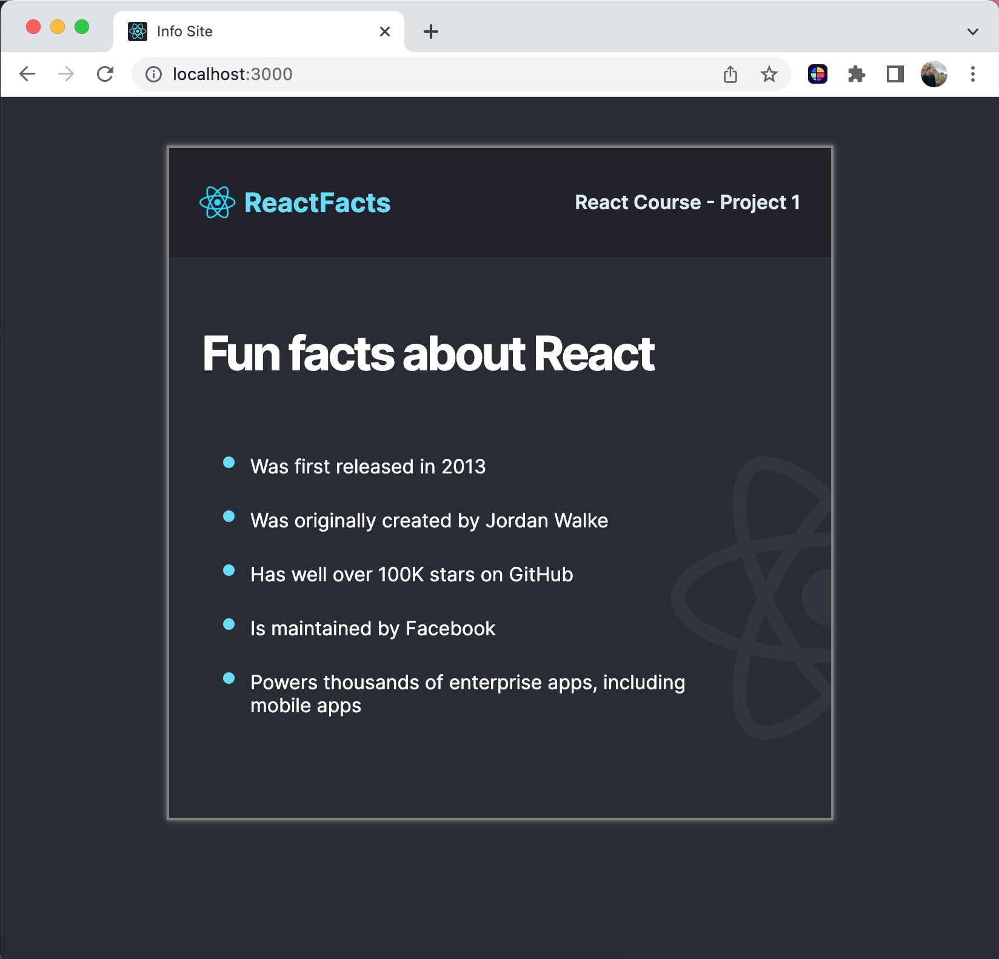

# React Basic Static webpage 

### I was first introduced to React during my Thinkful Engineering Immersion program last year. We built a Digital Flashcards project, which really opened my eyes to the potential React has. I found it perhaps my most favorite subject in my entire program and always wished I had more time to delve into it. Well... the time has now come where I can do just that!!

### I have now completed a very basic static webpage using React. I do love React and look forward to enhancing my skills much further than this, but here is a launching point!

### The main principles I worked on was learning how to utilize components, style my page with CSS, add images using the correct relative paths (which by the way was a lot different in React than I had experience before with just basic HTML/CSS files). After my project was complete, I also delved into a new way of deploying my site that I had not utilized before, using Netlify.

### react-info-sitefacts.netlify.app

### Although this is just a static webpage, the foundations are now set and I plan on building on top of these skills very soon!
